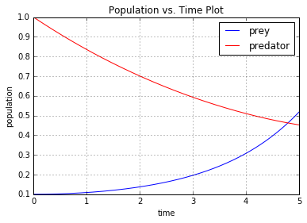
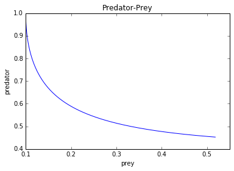
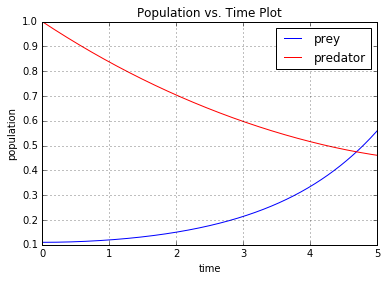
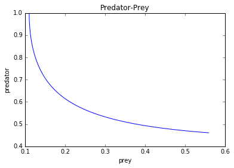

UECM3033 Assignment #3 Report
========================================================

- Prepared by: Vignesh Nagarajah
- Tutorial Group: T3

--------------------------------------------------------

## Task 1 --  Gauss-Legendre formula

The reports, codes and supporting documents are to be uploaded to Github at: 

[https://github.com/vigneshnagarajah/UECM3033_assign3](https://github.com/vigneshnagarajah/UECM3033_assign3)

Explain how you implement your `task1.py` here.
First of all, I need to find the Gauss-Legendre quadrature by implementing the code into self define function of def gausslegendre(f,a,b,n=20).And then I was able to find the matrix of x and w which are the nodes and weights by repeating for 20 times. Then, by using the x that I found,I use it to find t which used as substitute into the function f(x) into f(t) to find answer by adding up sum of w multiply by f(t) and multiply it by half of b-a where a and b are the integration from a to b which from the task 0 and 1.Furthermore, t can be find by using x, which is by the equation of 0.5(x+1)(b-a)+a.Then I can find the integration answer by using gauss legendre quadrature.

Explain how you get the weights and nodes used in the Gauss-Legendre quadrature.
The weights and nodes can be obtained by importing numpy.polynomial.legendre.leggauss.

---------------------------------------------------------

## Task 2 -- Predator-prey model

Explain how you implement your `task2.py` here, especially how to use `odeint`.

ODE system with odeint was used in order to generate task 2 to solve the predator-prey model,. Firstly , create a self-define function g , which can be used to identify the equation of differentiated prey and predator equations y  and the parameters a and b also needed to be inserted into the function. Then , create an array with initial condition , which was when x is 0 then the y will be 0.1 and 1.0 respectively. Then, chop the time which was 0 to 5 years into 1000 sections by using np.linspace(0,5,1000). After that, count the solution by using the scipy.integrate.odeint of self-defined function, initial condition and the time. The number of prey can be obtained by taking out the first column and predator by the second column in order to plot the graph of prey and predator vs time.Then , create the graph of population versus time by the help of matplotlib.pyplot.Simultaneously , the graph of predator versus prey also can be formed. Both the graphs were properly labelled as stated in the instruction. Then, for the second part, the initial condition was modified where the array will becme 0.11 and 1.0 respectively while other criteria will remain the same.

Put your graphs here and explain.

When the y0 is 0.1 , y1 is 1.0 

When the y0 is 0.11 , y1 is 1.0

From the graphs shown above,when there is a change in the initial condition y0 occurred,there is small difference occurred in the output as well .Apart from that ,the number of prey appeared to be the lowest when the the number of predator is the highest which clearly shows that there is an inverse relationship between the prey and predator. So, when the time increase, the prey will increase accordingly while there is a decrease in predators

Is the system of ODE sensitive to initial condition? Explain.

No, the system of ODE is not sensitive to initial condition. If the system of ODE is sensitive, the small amount changes of starting value will lead to more larger changes in output. So, from the graphs, we can observe that the changes of output is very minor.

-----------------------------------

last modified: change your date here<18th April 2016>
